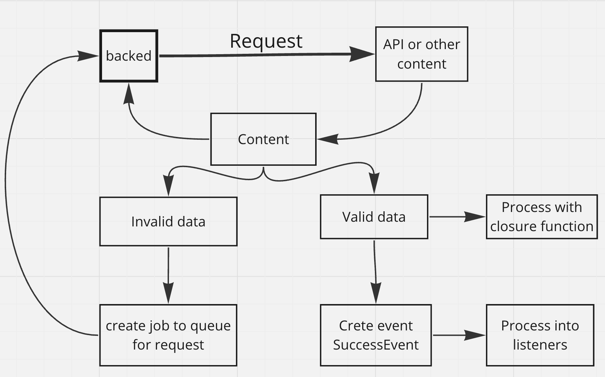

# Library for create persistent request.
## Why is it needed?
When to create a fault-tolerant request. 


## Compatibility
- php >=7.4
- guzzlehttp/guzzle >=6.3
- laravel/framework >=7.0
- laravel/serializable-closure "^1.*"

## Flow library


## Installation

```
composer require xman12/persistent-request
```

after library has been installed, publish its configuration file using:

```
php artisan vendor:publish --provider="PersistentRequest\ServiceProvider"
```

or add the following providers in config/app.php:
```
'providers' => [PersistentRequest\ServiceProvider::class]
```

Now need start queue work process invalid requests, call command:
```
php artisan queue:work
```

>If request will reach limit attempt when request delete from queue and dispatch 
event DeleteRequestEvent, which you can processed

## Example for create simple persistent request
```
// here we init service
$requestService = app(\PersistentRequest\Services\RequestServiceInterface::class);
// create instace of Request for send into guzzle client
$requestGuzzle = new \GuzzleHttp\Psr7\Request('get', 'https://google.com');
// create comfortable DTO for transfer to service, 
// first argument instance of guzzle request, second name event class, which will be call after success request
// third argument it'sleep seconds, number second after need try again do send request
// fourth argument, number try for send request
$requestDTO = new \PersistentRequest\DTO\RequestDTO($requestGuzzle, \PersistentRequest\Events\SuccessEvent::class, 30, 5);
// execute request, save into db serialize instance of RequestDTO, if request is success then row will be delete
$requestService->execute($requestDTO); 
```
### Example for create persistent request with closure 
```        
// here we init service
$requestService = app(\PersistentRequest\Services\RequestServiceInterface::class);
// create instace of Request for send into guzzle client
$requestGuzzle = new \GuzzleHttp\Psr7\Request('get', 'https://google.com');
// create comfortable DTO for transfer to service, 
// first argument instance of guzzle request, second name event class, which will be call after success request
// third argument it'sleep seconds, number second after need try again do send request
// fourth argument, number try for send request
// fifth argrument anonymous function, inside of function we can do businec logic your application, dispatch events etc.
$requestDTO = new \PersistentRequest\DTO\RequestDTO(
    $requestGuzzle, 
    \PersistentRequest\Events\SuccessEvent::class, 
    30,
    5
    function (\GuzzleHttp\Psr7\Response $response) {
    //here we can do businec logic your application
    // if need then request try again, just throw exception
    if (200 !== $response->getStatusCode()) {
        throw new \Exception('error processed');
    }
});
// execute request
$requestService->execute($requestDTO);
```
